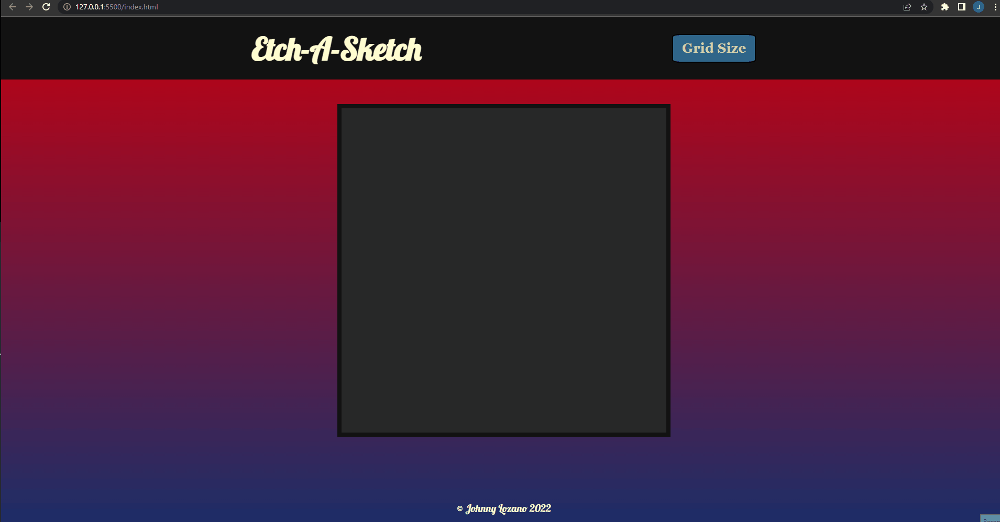

# Etch-A-Sketch

---

## Description
Etch-A-Sketch was a plastic toy game that was introduced around 1960, and it featured twisting knobs that created lineographic images. These images were created with a stylus that displaced aluminum powder onto the screen, and the images could be erased by simply shaking the device.

The browser game recreates that by allowing the user to draw on a pixel-grid screen by hovering with the mouse. The grid-size can be adjusted up to a 100 x 100 grid size by clicking the "Grid Size" button.

---

## How to Use
- Select grid size with the "Grid Size" button
- Use the mouse to hover over the desired square

